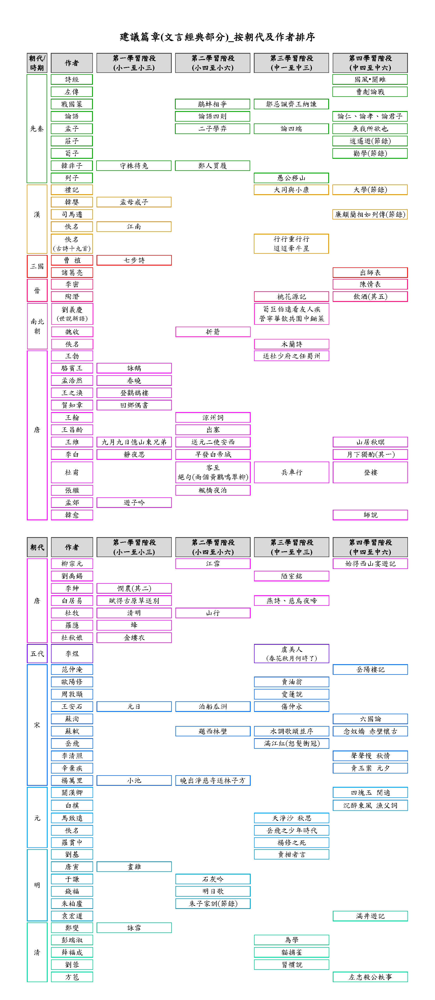

# 香港建議篇章篇目

- [中國語文課程 – 建議篇章](https://www.edb.gov.hk/tc/curriculum-development/kla/chi-edu/recommended-passages.html)

共分四學習階段：

## 第一學習階段

{{ read_csv("data/hk-香港建議篇章篇目-L1.csv") }}

## 第二學習階段

{{ read_csv("data/hk-香港建議篇章篇目-L2.csv") }}

## 第三學習階段

{{ read_csv("data/hk-香港建議篇章篇目-L3.csv") }}

## 第四學習階段

> ※ 为 12 篇香港中學文憑考試指定考核作品

{{ read_csv("data/hk-香港建議篇章篇目-L4.csv") }}
