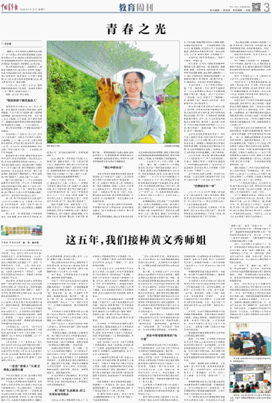
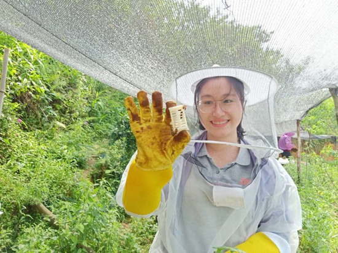

青春之光

祝红蕾　　来源：中国青年报　　（ 2024年06月26日   03 版）

<!-- 黄文秀在工作中。北京师范大学供图 -->

“灌溉200多亩农田的水渠被洪水冲断了！”这个消息让周末回家看望病重父亲的黄文秀坐立不安。她决定立即驱车返回百坭村，那里离她家所在的广西壮族自治区百色市田阳县（现田阳区）田州镇有180多公里。

黄文秀冒着雨出发了。雨起初还小，渐渐变为瓢泼大雨。黄文秀心急如焚，拨通了村支书周昌战的电话，商讨防洪对策。赶到凌云县路段时，暴雨倾泻，几乎看不清道路，巨大的水流仿佛要将车掀翻，冲走。黄文秀困在车中，进退两难。

2019年6月16日晚11点43分，她将拍摄的视频发到工作群里：“我被洪水困住了，有一辆车已经被水冲走了！”

凌晨1点之后，再无消息。

“我就是那个要回来的人”

周昌战至今记得2018 年3 月26 日第一次在镇政府见到黄文秀的情形。清秀的圆脸，个头不高，扎马尾辫，戴一副黑框近视眼镜，这位新来的百坭村第一书记“看上去文文弱弱，手不能提、肩不能扛的样子”。她能担负起带领群众脱贫致富的重任吗？周昌战在心里画了一个大大的问号。

黄文秀进村的第一件事就是到贫困户家摸底。

百坭村有11个自然屯，共472户，其中195户是贫困户。这些屯子分散在山坳里，山高路陡，上门一趟十分不易。让黄文秀意想不到的是，村民们要么推说有事，要么闭门不见。“这么年轻，来也就是镀镀金、走走过场。”村民们直言不讳，“一个女娃娃，我们不相信她。”

宿舍窗外青山含黛，静谧的夜里传来声声虫鸣，初来乍到的第一书记却无法入眠。百色是全国脱贫攻坚的主战场之一，父老乡亲守着青山绿水，却过着穷得叮当响的日子，怎不让她心焦？黄文秀想起自己曾经说过的话：“走出去之后，肯定有一部分人要回来的，我就是那个要回来的人。”如今，连贫困户的门都进不了，回来又能干什么呢？

整个村庄都沉睡了，10平方米的宿舍就像茫茫夜色中的一叶小舟，仿佛要被孤独和无助的海洋吞没。她打开了驻村日记，眼泪吧嗒吧嗒掉了下来：“我觉得心里憋屈，搞不懂为什么我辛辛苦苦地翻山越岭，走村串户，老百姓们却对我这么排斥……”

那一夜，黄文秀是怎样给自己鼓劲的？人们已无从知晓。不过，从她留下的日记里，可以读到这样一句话：“长征中，战士死都不怕，在扶贫路上，这点困难怎么能限制我前行？”

第二天天一亮，她就找到了村里的老支书，向他请教。老支书的话平平淡淡，却语重心长：“老百姓们跟你熟了，自然就接纳你了。”

此后，黄文秀一有空就往村屯跑，不让她进门的，她就去两次、三次；人家去田里干活儿，她就去帮忙；哪位老人行动不便，她卷起袖子就帮着打扫院子。她还学会了桂柳话，走到哪里都和村民们熟络地打招呼。慢慢地，村民们对她打开了家门，敞开了心扉：“你这个女娃娃还真是难缠得很哩！”

百布屯、百爱屯、长沙屯……每走访一户，她就在本子上做一个标记——村部用五星标识，圆点代表人家，短线代表山路或河流。两个月的时间，黄文秀用双脚丈量了百坭村的沟沟坎坎，逐一走访了村里的贫困户。小小一个点，短短一条线，浓缩了百坭村的山水风土、村情民意，汇成了一份贫困户分布图。有了它，黄文秀心里有底了。

脱贫攻坚要“扶志”，更要“扶智”，上学、看病、衣食住行，一样都不能少。突破口到底在哪里呢？百坭村气候湿润，沙质土壤适合砂糖橘生长，抓产业富民，首选砂糖橘。可村民缺少技术，看天种，靠天收；交通不便，销路不畅……要把砂糖橘产业做大做强，就得找好带头人，打通销售渠道。和周昌战合计了砂糖橘产业的发展前景后，带领全村人脱贫的路线图在黄文秀心中清晰起来。

“我心中的长征”

当黄文秀泥水淋漓地站在班统茂面前的时候，这个壮家汉子“认栽”了。这已经是黄文秀第三次到班统茂家“围追堵截”了。第一次，他根本不搭理。第二次，他挠挠头说：“我自己刚脱贫，也没什么技术，产业带头人我怕是当不了，你另找别人吧。”他一边说，一边把黄文秀“请”出了家门。此后，哪怕是远远见到她，班统茂都会绕道走，但没想到，这个执拗的第一书记又趁雨天将他堵在家里。

“班大哥，你只要认真种好你家的果，再领着乡亲们扩大种植面积，其他问题我来解决。”来不及擦去身上的泥水，黄文秀诚挚地说。

黄文秀说到做到。她从县里请来农业技术员给果农指导果树管理；带领干部村民赶在砂糖橘成熟前把破损路面修好；联系外地果商上门收购，在村里建起了电商服务站。

“一个女娃子，开1个多小时车，山路上跑了一趟又一趟，人家图什么？人心都是肉长的，是不是？”班统茂深受感动，埋头干了起来。他带头成立砂糖橘种植专业合作社，带动果农施肥，疏果，治虫，建设“标准化果园”……2018年百坭村砂糖橘大丰收，产量高达90万斤。黄文秀通过朋友圈和电商服务站昼夜不停地发布信息，联系买家，仅电商服务站就售出了两万多斤，带动每户增收2500元，砂糖橘的销售由此搭上了“快车”。这一年，班统茂和他带动的4户果农户均收入10多万元，全村村民收入达200多万元。

砂糖橘热销让村民尝到了产业致富的甜头，但黄文秀清醒地认识到，“群众富不富，关键看支部”，打赢脱贫攻坚战要靠党组织的力量。在她的带动下，百坭村党支部落实“三会一课”制度，建起了百坭村新时代讲习所。村干部坐班值班常态化，也都学会了用电脑，积极帮助村民扩大种植规模、办理新农合新农保……村支部的凝聚力和号召力越来越强，村民的心气干劲也越来越高。周昌战由衷地称赞文秀：“她年轻有文化，点子多，做事有韧劲，大家都服气！”

百坭村成了脱贫攻坚的热土，家家户户都有了致富产业。

每天清晨，百坭村人都能看到精神抖擞的黄文秀。她和村民一起采摘茶叶，浇灌蔬菜，盘算一年的收成。她和村委班子成员带领村民遇阻修路，逢水架桥，遇暗装灯。一天，她忙完回到宿舍，鞋都没脱就睡着了。天蒙蒙亮时醒来，浑身散架一般。要不休息一天？她摇摇头，还有那么多事等着她呢。

村民们喜欢上了这个和他们想到一起、干在一起的第一书记。那用屯通路那天，一位大娘顶着烈日将热乎乎的熟鸡蛋塞到文秀手里：“路通了，好日子也有盼头了！闺女歇一会儿，别累坏了。”她眼睛一红，眼泪就下来了。她在日记中写道：“每天都很辛苦，但心里很快乐。”

黄文秀开着贷款买的车行驶在山路上。刚开始，对面来车时她只得靠边停下；雨天泥泞时车轮空转打滑，同行的周昌战都心惊肉跳。可不到一个月的时间，她就能熟练地开着车，在市、县、村之间来回奔波着为乡亲跑项目、请专家了。驻村满1年那天，汽车仪表盘里程数正好增加了2.5万公里。黄文秀发了一条朋友圈：“我心中的长征，驻村一周年愉快。”

这长征没有风雪载途的夹金山，没有不见人烟的大草地，有的只是百坭村的一条条山路。2.5万公里啊！黄文秀几乎天天奔波在路上，崎岖的山路既是通往幸福生活的致富道路，也是她攻坚克难的奋斗之路。在这没有硝烟的长征路上，她铆足了劲儿与时间争分夺秒地赛跑，一刻不曾停息。

2018年年底，通屯路、硬化路连接起了4个屯的家家户户，两个屯的夜色第一次被47 盏路灯照亮，4座蓄水池建起来了，村民的腰包也鼓起来了。全村有88 户成功脱贫，贫困发生率从文秀刚刚上任时的22.88% 下降到了2.71%。

这个来自红色热土的第一书记在日记里写道：“让扶过贫的人像战争年代打过仗的人那样自豪！”“不获全胜，决不收兵！”

“仿佛她还在一样”

2019年6月18日中午，救援人员在凌云县下游河道发现了黄文秀的遗体。噩耗传来，村民们纷纷挤到村部。有人失声痛哭，有人坚决不信——那么年轻阳光的一个人怎么能说走就走呢？

班氏会呆呆地站着，五雷轰顶一样，喃喃道：“我不信文秀书记回不来了。”黄文秀帮她患先天性脑病的儿子申请了低保，春节来看望她时还给了孩子压岁钱。

“那么难走的路，去年她往我家跑了12趟，帮我申请了养老补贴，还帮我申请了油茶树的贴息贷款，对我就像亲闺女一样好。”百坭村最南端者乐屯的韦乃情伤心地哭了。

班统茂泪如泉涌：“没有文秀书记，我过不上这样的好日子。”

孩子们蹲在文秀宿舍门口，抱着膝盖，久久不肯离去。就在前几天，文秀姐姐还在教他们绘画、书法，教他们敲着用竹筒自制的乐器唱诵村规民约。她清亮的嗓音，仿佛仍在空中回荡。

然而，文秀真的走了，花儿般灿烂的30岁生命，永远定格在扶贫路上。

村民们忘不了文秀常背的双肩包。包里除了笔记本、雨伞、手电筒，还有村民需要的创可贴、感冒药、农业技术资料，给孩子们的糖块和鞋袜，给孤寡老人的毛巾等日用品。每家每户的所需所盼，都装在这小小的包里，装在她的心中。

村民们忘不了文秀天天穿着的运动服和运动鞋。到百坭村后，黄文秀收起了最爱的连衣裙和高跟鞋，常年一身运动打扮爬坡过坎，进村入户。她的宿舍，只有一顶蚊帐、一张硬板床，床下整齐摆放着两双运动鞋和两双水鞋，旧木桌上放着一本《西行漫记》、两本驻村日记。一件尚未摘掉吊牌的鱼尾裙还静静躺在柜子里，等着爱美的主人来把它穿上。

村民们更不会忘记文秀那向日葵一样灿烂的笑容。带着村民修路时她笑，和村民一起采茶时她笑，在村民家里拉家常时她笑……每一天，她都这样微笑着，奔走在脱贫攻坚的路上。她的笑容像阳光一样，让人心生温暖和力量。可是很少有人知道文秀是靠各方资助才得以完成学业的，她的家，毛坯屋、水泥地，“沙发”是废旧轮胎和木板搭成的。文秀的父亲黄忠杰——这位不管多难都坚定支持女儿读书、教育女儿要感恩的老人，哽咽着谢绝了慰问金：“家里的困难，我们自己克服……这些钱拿给更需要帮助的人吧。”

路灯亮起来了，村民们驻足凝望怀想，有人在轻声自语：“仿佛她还在一样。”在百坭村人心里，这个大山的女儿从未离开。路灯的光洞穿了山村暗夜，正如黄文秀的青春之光点燃了这片土地上的希望。

“一个人要活得有意义，生存得有价值，就不能光为自己而活，要用自己的力量为国家、为民族、为社会作出贡献。”黄文秀曾在入党申请书里写下这样一句话。

为了打赢脱贫攻坚战，全国有300多万名干部奔赴农村和山区，担任第一书记和驻村干部，1800多人牺牲在一线。和黄文秀一样，他们把自己火热的心、赤诚的爱，交付给了自己驻守的土地。和黄文秀一样，他们在最穷苦的地方坚守初心，扎根奋斗，用青春的热血点亮了万家灯火，让这点点火光连接成了新时代光的海洋。
